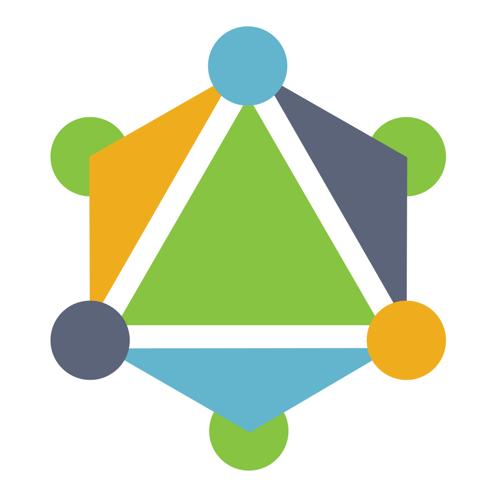

## jamesmacaulay/elm-graphql

A [GraphQL](http://graphql.org) library for [Elm](http://elm-lang.org), written entirely in Elm.

The goal of this package is to provide a really good interface for working directly with GraphQL queries and schemas in Elm. Right now the main offering of the package is an interface for building up nested queries and mutations in a way that also builds up a decoder capable of decoding successful responses to the request. The package also provides a module for sending these requests to a GraphQL server over HTTP and decoding the responses accordingly.

Here's [an end-to-end example](https://github.com/jamesmacaulay/elm-graphql/tree/master/example) that builds a query, sends it to a server, and decodes the response.

### Building requests

Building up a GraphQL query with this package feels a lot like building a JSON decoder, especially if you are familiar with the [elm-decode-pipeline](http://package.elm-lang.org/packages/NoRedInk/elm-decode-pipeline/3.0.0) package. First you define type aliases for each of the nested record types you want to construct out of the response:


```elm
import GraphQL.Request.Builder exposing (..)
import GraphQL.Request.Builder.Arg as Arg
import GraphQL.Request.Builder.Variable as Var

type alias Photo =
    { url : String
    , caption : String
    }

type alias User =
    { name : String
    , photos : List Photo }
```

Then you build a query document:

```elm
userQuery : Document Query User { vars | userID : String }
userQuery =
    let
        userIDVar =
            Var.required "userID" .userID Var.id

        photo =
            object Photo
                |> with (field "url" [] string)
                |> with (field "caption" [] string)

        user =
            object User
                |> with (field "name" [] string)
                |> with (field "photos" [] (list photo))
        
        queryRoot =
            extract
                (field "user"
                    [ ( "id", Arg.variable userIDVar ) ]
                    user
                )
    in
        queryDocument queryRoot
```

The `Document` type can represent both query and mutation documents. It lets you do two important things:
  
  * generate GraphQL request documents to send to the server, and
  * decode JSON responses from the server.

Here's what the above Document looks like when you encode it to a string to be sent to the server:

```graphql
query ($userID: ID!) {
  user(id: $userID) {
    name
    photos {
      url
      caption
    }
  }
}
```

To supply values for the variables used in the `Document`, you provide an Elm value that your variables can extract values from according to the getter functions supplied when you define the variables. In this example, the `"userID"` variable was defined as a string that's extracted from the `userID` field of some Elm record, so the following code is a valid way to create a `Request` with the required variable values supplied:

```elm
userQueryRequest : Request Query User
userQueryRequest =
    userQuery
        |> request { userID = "123" }
```

Assuming you've built a query that is valid for the server's schema, sending it to the server will result in a JSON response that can be decoded by the very same `Query User` value, using a JSON decoder that is built up along with the structure of the query. Here's what a JSON response for `userQuery` might look like:

```
{
  "data": {
    "user": {
      "name": "Lola",
      "photos": [
        {
          "url": "http://cdn.catphotos.com/lola.jpg",
          "caption": "Lola curling up on the chair"
        }
      ]
    }
  }
}
```

When it is decoded with the help of the decoder contained in `userQuery`, it becomes this:

```elm
{ name = "Lola"
, photos =
    [ { url = "http://cdn.catphotos.com/lola.jpg"
      , caption = "Lola curling up on the chair"
      }
    ]
}
```

Mutations are built just like queries, except that you wrap them up in a call to `mutationDocument` instead of a call to `queryDocument`. Here's an example of a mutation that logs in a user and extracts an auth token from the response:

```elm
type alias LoginVars =
    { username : String
    , password : String
    }


loginMutation : Document Mutation String LoginVars
loginMutation =
    let
        usernameVar =
            Var.required "username" .username Var.string

        passwordVar =
            Var.required "password" .password Var.string
    in
        mutationDocument <|
            extract
                (field "login"
                    [ ( "username", Arg.variable usernameVar )
                    , ( "password", Arg.variable passwordVar )
                    ]
                    (extract (field "token" [] string))
                )
```

### Future plans for this package

There are a lot of things that this package can't do right now, but might do in the future. What gets done depends on how the package ends up being used, and how much demand there is for each feature. Here are some likely possibilities:

* support for [subscriptions](https://dev-blog.apollodata.com/graphql-subscriptions-in-apollo-client-9a2457f015fb)
* generating code from a GraphQL schema to help build valid queries
* providing functions to validate a query against a target schema
* leveraging Relay-compliant schemas to cache response data and transform queries so that the client only asks the server for what it doesn't have already
* providing an interface to implement a GraphQL schema that you can run queries against
